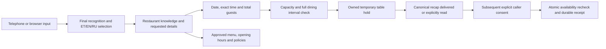

# Restaurant operations

## Current scope

`VOICEBOT_BUSINESS_TYPE=restaurant` selects restaurant reception in the web app
and native telephone worker. Estonian, English and Russian remain supported,
including language detection, greetings, concise questions, owned booking
recaps, consent and cancellation. Optional modern browser voices retain their
existing configuration and fallback behavior. Browser turns use bounded NDJSON
audio streaming and require an exact terminal response before acknowledging a
recap. Seeking, interruption and incomplete audio do not acknowledge it.

The bundled restaurant, menu, capacity and guests are fictional. Restaurant
specialization consists of validated knowledge, prompts, deterministic routine
replies and regression scenarios. No model weights were fine-tuned. No real
restaurant menu, booking provider, carrier call or allergy safety is verified.

## Pipeline



`RestaurantCallTools` is selected by `app/call_factory.py` for both transports.
`RestaurantAdapter` bridges the existing call ownership and consent machinery:
internal service IDs encode party size and provider IDs identify dining tables.
The model sees restaurant tools, never hotel/spa workflows. The public restaurant
API also uses these same call tools rather than writing around consent.

SQLite holds and reservations are scoped by `restaurant_id`; overlapping active
holds and confirmed reservations occupy capacity. Dining intervals must fit
fully inside opening hours. Atomic writes use `BEGIN IMMEDIATE`; independent
processes cannot confirm the same occupied table interval. Action receipts
survive restart. Unknown mutation outcomes block retries and require inspection.
See [SQLite transaction semantics](https://www.sqlite.org/lang_transaction.html).

The default hold lasts 120 seconds, dining lasts 90 minutes, starts are every
15 minutes, the advance window is 90 days and the largest group is six. All are
operator configuration, checked again before a held table is confirmed. Children
count toward capacity. Ambiguous component counts prompt for the total.

## Natural conversation and visible demo reservations

The assistant uses short questions in all three languages and speaks recap
dates with month names. Estonian confirmation accepts a closed list of explicit
whole-turn phrases, including `Jah, kinnitan.`, `kinnitan`, `jah palun kinnita`
and the known recognition spelling `ja kinnitää`. These variants also guide
language selection when recognition metadata is wrong. This is transcript
handling, not speech-model training or a measured change in recognition accuracy.
Questions, quoted examples, declines and mixed changes are not consent. A
current owned recap must still have been delivered before a later final turn;
partial recognition and expired or interrupted recaps cannot confirm a table.

Successful demo confirmations and cancellations refresh the website's
authenticated reservation list, select the actual reservation date, reset its
page and mark the affected row. A `View reservation` button in the conversation
opens that list. Direct-form confirmations use the same behavior. Ending a
conversation or reloading the page does not delete its saved reservation;
reconnect with the operator token and choose its date to see it again. Logout
clears private browser data. The underlying reservations remain in the shared
SQLite database; they do not reserve tables at a real restaurant.

## Restaurant knowledge

Routine replies use short approved sentences. Identical hours on consecutive
days are spoken as a range; different hours, closed days and the kitchen closing
offset remain separate. A requested weekday or weekend limits the answer to
those days. Today, tomorrow and an explicit ISO date also check date-specific
closures. A follow-up such as "Aga köök?" retains the preceding hours selection.
The public restaurant API exposes the same `opening_hours_summary` and
`kitchen_hours_summary` in ET/EN/RU for deployment readback.

Reviewed question matching also covers menu wording, declared ingredients and
allergens, prices, location, children, group size, reservation duration,
cancellation guidance, changes, late arrival, parking, pets, highchairs,
accessibility, terrace seating and additional menu information. Unknown venue
facts receive brief staff guidance; these replies do not establish amenities,
real transfers, modification support or allergy safety. Up to three recognized
information topics can be answered together without creating a reservation.
Only bounded topic, day, date, dish and diet selectors survive a relevant
follow-up; unrelated turns discard that context. General menu replies omit the
long allergy notice, while allergy/ingredient questions retain it.

An optional `pet_policy` object supplies a short approved answer in `et`, `en`
and `ru` to questions about bringing dogs or other pets. For example, an operator
can specify that dogs are allowed, not allowed, or allowed only on the terrace.
All three translations must be nonempty; malformed policies fail configuration
validation. If this field is absent, the assistant explicitly says the rule is
unknown and asks the guest to check with staff. Caller claims never establish
the rule. The public restaurant API includes the configured policy with the
other venue data.

Edit a copy of `data/demo/restaurant-demo.json` and place it on the persistent
shared volume, for example `/data/restaurant.json`. Set
`RESTAURANT_CONFIG_PATH=/data/restaurant.json` in web and native worker runtime
and restart both. The deployment manager copies this path from the trusted web
container and rejects paths outside `/data`, preventing different venue facts in
the two transports. Without the variable, both images use the bundled file.

Required translated text has `et`, `en` and `ru` entries. Configure opening hours
for all seven named weekdays, date-specific closures, unique table IDs and
capacities, menu names, declared allergens, dietary labels and reviewed policies.
Invalid configuration fails closed. Current speech and calendar guards require
`Europe/Tallinn`. Only synthetic configurations are accepted. Prices and street
addresses remain unset until their trusted source and supported contract exist.

The assistant never guarantees allergy safety or absence of cross-contact.
Large parties, accessibility, highchairs, special seating, complaints and
unavailable facts get staff-verification guidance. The demo does not transfer a
real call, promise a callback, take payment or place a food order.

## Deployment

```dotenv
VOICEBOT_BUSINESS_TYPE=restaurant
RESTAURANT_DEMO_WRITES=1
RESTAURANT_STATE_DB=/data/restaurant-booking.db
CALLS_DB=/data/calls.db
# Optional: RESTAURANT_CONFIG_PATH=/data/restaurant.json
```

The write flag authorizes fictional reservations only. `0` explicitly disables
them. If absent, it inherits the already authorized `EASY_DEMO_WRITES` value so
existing synthetic installations can migrate without new server credentials.
EasyAppointments credentials are not required for restaurant mode. Never scale
web sessions across replicas: call and recap state still resides in process
memory. Web and native workers must share the same persistent SQLite volume on
one host. This is not a multi-host database architecture.

GitHub master deployment updates the web image. The separate LiveKit worker
must be rebuilt/replaced, or updated by an already installed release-sync
service. Preserve existing media and bridge resources. The deployment manager's
`--worker-only` and `--bridge-source-container` options remain available. A
successful `/api/status` response reports configuration, not a live telephone
call or native worker deployment verification.

Rollback: set `VOICEBOT_BUSINESS_TYPE=hotel_spa` in both transports and restart.
The older hotel/spa state files and historical regression fixtures are retained;
restaurant data uses its own database and does not migrate prior reservations.

## Local checks

Run the core and separate media suites with their project environments:

```powershell
.venv/Scripts/python.exe -m pytest -q
.venv-media/Scripts/python.exe -m pytest -q
$env:NODE_PATH='C:\Users\salov.ml7b493\AppData\Local\Programs\CodexTools\node_modules'
$env:PLAYWRIGHT_BROWSER_CHANNEL='chrome'
node tests/run_browser_checks.cjs playwright .venv/Scripts/python.exe restaurant_browser_checks.js
```

The browser runner starts isolated fixture servers on temporary loopback ports.
Only fixture credentials, local synthetic MP3 audio, synthetic microphone input
and provider doubles are used. The tests exercise the actual API, SQLite,
microphone filtering/resampling, browser streaming, consent and UI lifecycle;
they do not measure real speech recognition or provider voice quality.
